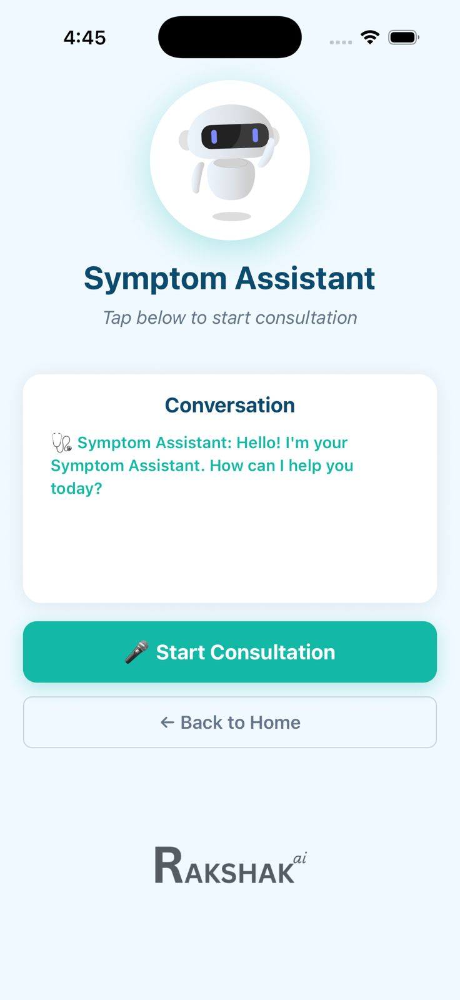
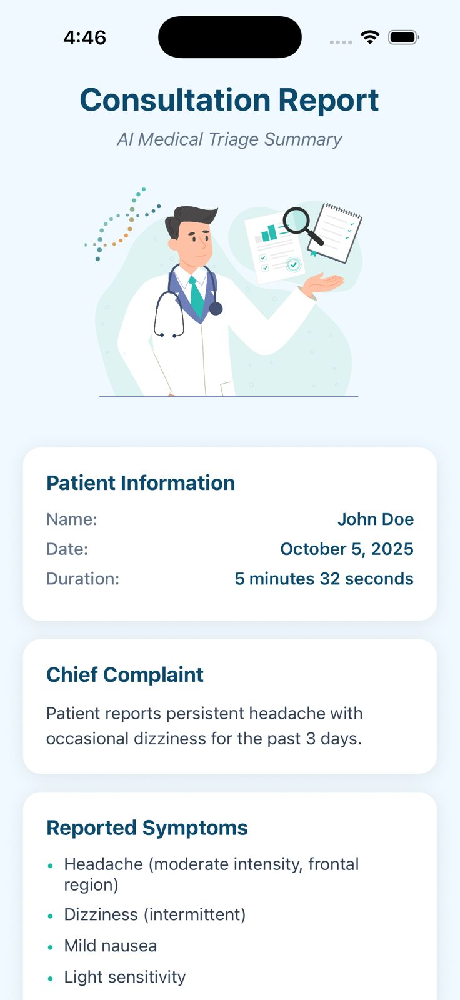
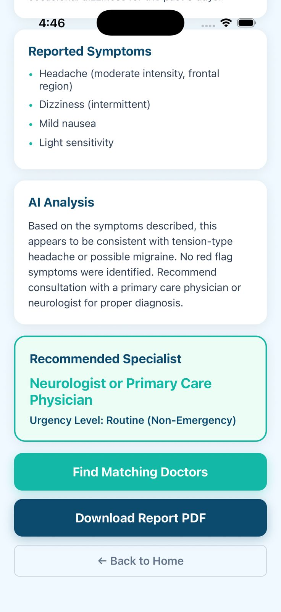
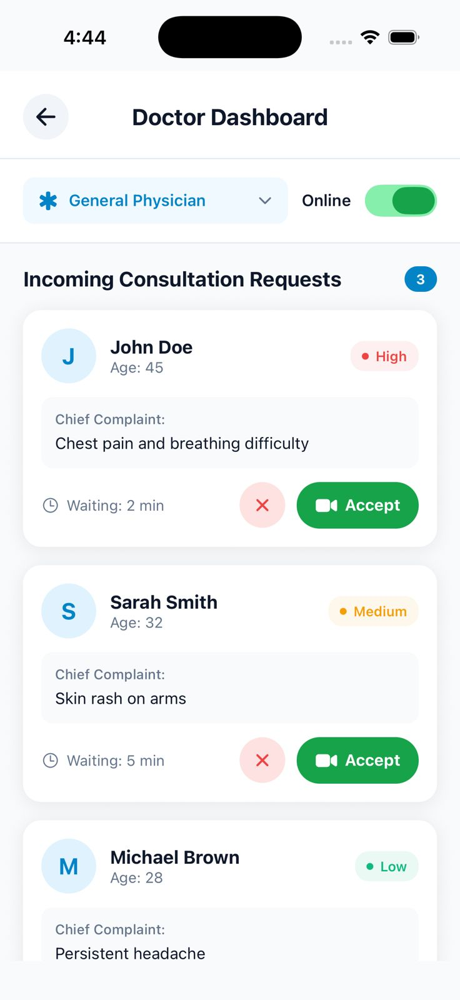
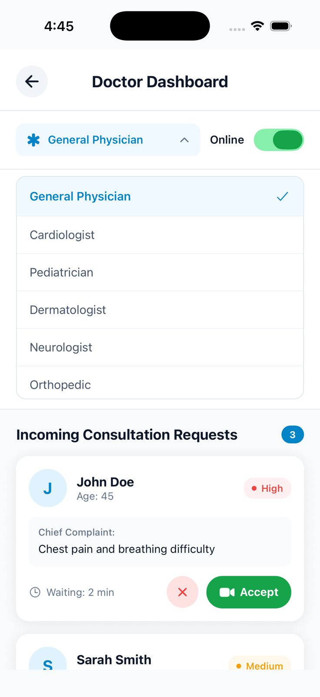
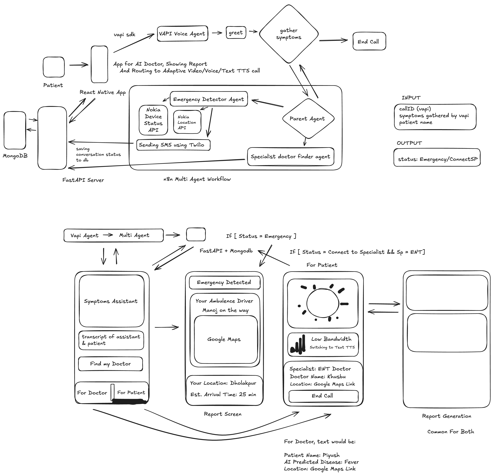

# 🚨 SwiftCare – Ensuring quick medical response.

A Python-based application designed to assist healthcare professionals in managing emergency situations efficiently. It includes modules for **data processing, triage prediction, resource allocation, demand forecasting, database operations, and caching**.

---
## ✨ iOS Screenshots (📱 Mobile App Preview)

| | | |
|:---:|:---:|:---:|
|  |  |  |
|  |  |  |
|  |  |  |

> 📸 *iOS Interface showcasing patient triage flow, doctor dashboard, and emergency alerts.*

---

## ✨ System Architecture Diagram



> 📊 *Excalidraw diagram showing the SwiftCare multi-agent system architecture and data flow.*

---

## ✨ Features


- **📊 Data Processing:** Load, preprocess, and extract features from patient data.
- **🚑 Triage Prediction:** Predicts triage categories using a **Random Forest model**.
- **🏥 Resource Allocation:** Optimizes hospital resource distribution with **linear programming**.
- **📈 Demand Forecasting:** Predicts resource demand using **Prophet forecasting model**.
- **🗄️ Database Operations:** Saves and retrieves patient data using **SQLAlchemy**.
- **⚡ Caching:** Implements Redis for quick access to frequently used data.

---

## 📂 Table of Contents
- [🚀 Setup Instructions](#-setup-instructions)
- [📁 Directory Structure](#-directory-structure)
- [💡 Usage Examples](#-usage-examples)
- [🌐 API Endpoints](#-api-endpoints)
- [🐳 Docker Setup](#-docker-setup)
- [✅ Testing](#-testing)
- [🤝 Contributing](#-contributing)
- [📜 License](#-license)
- [📬 Contact](#-contact)

---

## 🚀 Setup Instructions

### 1️⃣ Prerequisites
Ensure you have the following installed:
- **Python 3.8+**
- **Redis** (for caching)
- **PostgreSQL/SQLite** (for database operations)

### 2️⃣ Install Dependencies
```bash
pip install -r requirements.txt
```

### 3️⃣ Configure the Project
Create a `config/config.yaml` file:
```yaml
logging:
  level: INFO
  format: "%(asctime)s - %(levelname)s - %(message)s"
  file: logs/system.log

data:
  file: data/mock_patient_data.csv
  test_size: 0.2
  random_state: 42

models:
  triage:
    type: RandomForest
    n_estimators: 100
    random_state: 42

forecasting:
  periods: 7

database:
  url: sqlite:///data/patients.db  # Use PostgreSQL for production

cache:
  host: localhost
  port: 6379
  db: 0
```

Create sample patient data (`data/mock_patient_data.csv`):
```csv
heart_rate,blood_pressure,oxygen_level,injury_severity,triage_category
120,80,95,3,Yellow
80,120,98,1,Green
150,60,85,5,Red
90,110,97,2,Yellow
130,70,92,4,Red
```

### 4️⃣ Run the Application
#### Start the REST API:
```bash
uvicorn api.main:app --reload
```
> API available at **http://127.0.0.1:8000**

#### Run the Main Script:
```bash
python main.py
```

#### Run Tests:
```bash
pytest tests/
```

---

## 📁 Directory Structure
```
emergency_system/
│
├── config/
│   └── config.yaml                # Configuration settings
│
├── data/
│   └── mock_patient_data.csv      # Mock patient data
│
├── logs/
│   └── system.log                 # Application logs
│
├── modules/                       # Core functionality modules
│   ├── data_processing.py         # Handles data loading & preprocessing
│   ├── models.py                  # Machine learning models
│   ├── allocation.py              # Resource allocation logic
│   ├── forecasting.py             # Demand forecasting logic
│   ├── database.py                # Database operations
│   ├── caching.py                 # Redis caching
│
├── api/
│   └── main.py                    # FastAPI implementation
│
├── tests/                         # Unit tests
│
├── main.py                        # Application entry point
├── requirements.txt               # Dependencies list
├── Dockerfile                     # Docker container setup
└── README.md                      # Project documentation
```

---

## 💡 Usage Examples

### 1️⃣ Predict Triage
```bash
curl -X POST "http://127.0.0.1:8000/triage" \
     -H "Content-Type: application/json" \
     -d '{"heart_rate": 120, "blood_pressure": 80, "oxygen_level": 95, "injury_severity": 3}'
```

### 2️⃣ Allocate Resources
```bash
curl -X POST "http://127.0.0.1:8000/allocate-resources" \
     -H "Content-Type: application/json" \
     -d '[{"heart_rate": 120, "blood_pressure": 80, "oxygen_level": 95, "injury_severity": 3}]'
```

---

## 🌐 API Endpoints
| Endpoint | Method | Description |
|----------|--------|-------------|
| `/triage` | POST | Predicts triage category for a patient. |
| `/allocate-resources` | POST | Allocates hospital resources for patients. |

---

## 🐳 Docker Setup
### Build the Docker image:
```bash
docker build -t emergency-system .
```
### Run the container:
```bash
docker run -p 8000:8000 emergency-system
```

---

## ✅ Testing
Run unit tests:
```bash
pytest tests/
```

---

## 🤝 Contributing
1. **Fork the repository**
2. **Create a new branch**
   ```bash
   git checkout -b feature/your-feature-name
   ```
3. **Commit your changes**
   ```bash
   git commit -m "Add your feature"
   ```
4. **Push to GitHub**
   ```bash
   git push origin feature/your-feature-name
   ```
5. **Open a pull request** 🚀

---

## 📜 License
This project is licensed under the **MIT License**. See the `LICENSE` file for details.

---

## 📬 Contact
For questions or feedback, reach out to:

👤 **Siddhi Kandpal**  
📧 Email: [siddhikandpal43@gmail.com](mailto:siddhikandpal43@gmail.com)  
🐙 GitHub: [siddhikandpal](https://github.com/siddhikandpal)

---

⭐ **If you like this project, please give it a star on GitHub!** ⭐

